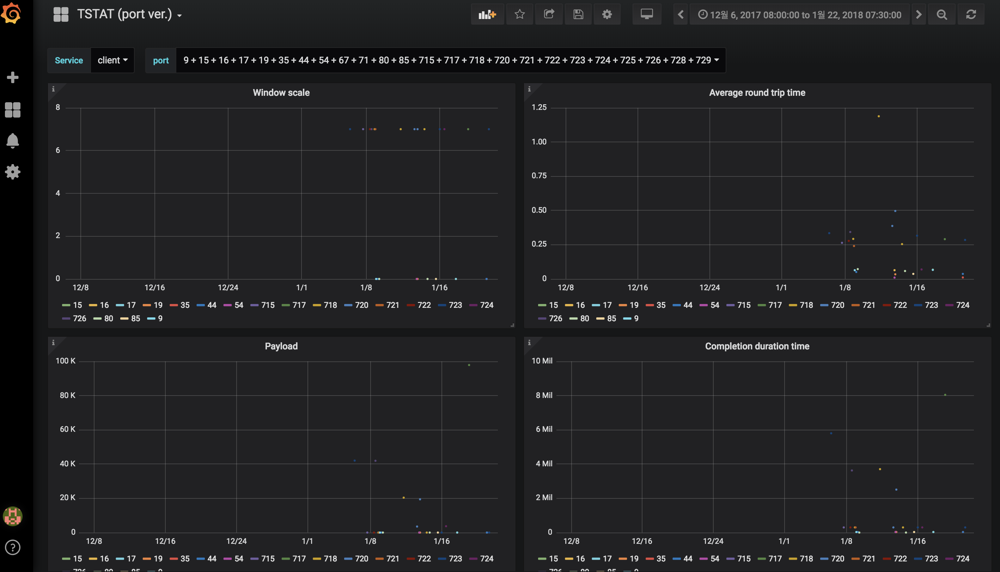

## 2019 FEB WEEK FIRST

#### Things to do

- [x] Divide the graphs by server and client.

	- Store datas into each service's measurement.
	
	I store the server's data into 'server' measurement in influxDB, the client's data into 'client' measurement. So, When I write 'SHOW MEASUREMENTS' command, the result text are 'server' and 'client'.

	- Add variables 'Service'.

	To enable to choose server or client, add the measurement (server, client) as variable. The setting is like below picture.
	

	- Modify query.

	I stored data into each measurements as service name, so, have to modify the 'FROM' portion of the query statement. Grafana have to extract data from which user choose on 'Service'. The example in 'completion duration time' is below picture.

	

RESULT: I stored the data from 2018_01_05_19_27 to 2018_02_05_20_40 as test.

- Server

- Client

	 	
- [x] Make user can view the graph to select a host or port.

	- Make another dashboard.
	
	Actually, it is difficult and takes some time to display about port or host address which user selects in one dashboard. So, I divided the dashboard into port and host. 

	

	- In port version dashboard, user can't select 'all' option.

	In stored data at influxDB, there are so many port numbers over 2,000. So, when I chose the 'all' option in port, not only it takes so many times, but the page also isn't completely loaded sometimes. Thus, in port version dashboard, user can choose multi-points port but not 'all'.

	- Modify variable query (Both in host and port version)

	I found the bug that variables extract the values from both 'server' and 'client' measurements. So, there was need to set the measurement which user selects. Previously, I set the measurement that can be selected by user as '$Service' variable. It's simple. Just add 'FROM $Service' in queries that extracts the port and host. The detail query is below picture.(Example in port.)

	

RESULT: The below picture visualized just a few data.

- [ ] Fix the bug that all data isn't stored in influxDB completely.

#### Things to do next week

- Check that bug is fixed completely.
- Rewrite the README.md file.
- Pull & Request to master branch.
