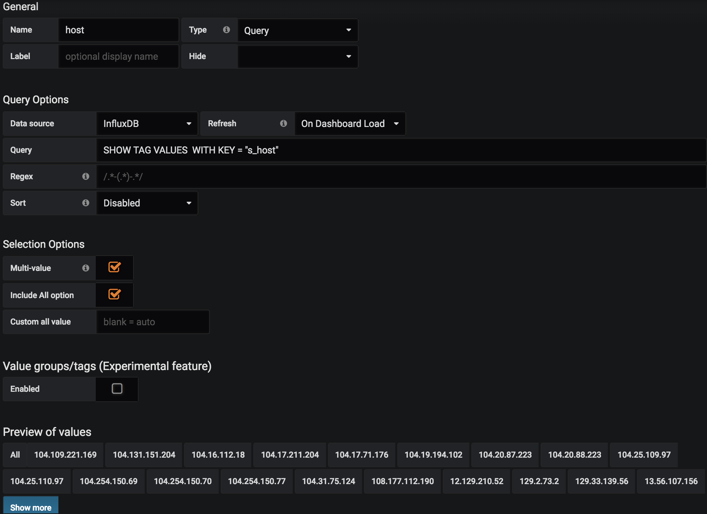

## 2019 JAN WEEK 05

#### Things to do

- [x] View the dashboard without login.

	- Refer the Grafana documentation(http://docs.grafana.org/auth/overview/#anonymous-authentication) to modify Grafana configure file(/etc/grafana/grafana.ini).
	In auth.anonymous section, fill the information like below.
	
	<pre><code>[auth.anonymous]
	enabled = true

	# Organization name that should be used for unauthenticated users
	org_name = Main Org.

	# Role for unauthenticated users, other valid values are `Editor` and `Admin`
	org_role = Viewer</pre></code>
	
	I wandered for about one hour because of the org_name. The organization name can be created in 'grafana page > Configuration > Server Admin > Orgs'. Thus, you can do it with admin authority. 

	

	If you add new organization, you can create dashboards on each organization. And if you set the name of new-organization as the org_name, anonymous will be accessible to the organization's dashboard. The anonymous's role is up to org_role.

	And disable basic auth.

	<pre><code>[auth.basic]
	enabled = false</pre></code>

	But, keep disable_login_from true contrary to documentation. Because if there's need to modify or configure some information in grafana, admin have to login and apply. So, direct access to login page keeps possible.

RESULT: When I access to 'localhost:3000', I can see the Main Org's dashboard. If I click the 'TSTAT' dashboard, I can see the TSTAT's graph.

- [x] Remove the 'log_tcp_complete.name of data' from graph variable.

	- Add variable in dashboard.

	Dashboard > Settings > Variables. You can add variable that may be the optional item in select box on dashboard. First, I add the server's 'host' as test. I want to see the graph about all hosts or the selected hosts. So, I checked on 'Multi-value' and 'Include All option'. The other setting that I did is below picture.

	

	- Modify query.

	Then, I modified the query. I removed the 'GROUP BY host' and replace it with 'ALIAS BY $tag_s_host'. 's_host' is key name of server's host which is stored in influxDB. When I wrote 'GROUP BY host' in query, the hosts were displayed with DB's table name and data aggregation function (MEAN, FIELD, etc). That was too long, so when use 'ALIAS BY $tag_s_host', just can only see the server's ip address. Previously, I added server's host as the variable so, I can select the host which I want to see. To do so, write 's_host=~/^host$/' in WHERE command (The word which appended between ^ and $ is the name of tag that set in Variables page).  The detail query is below.

	

RESULT

- [x] Modify the process.py to insert data about client to influxDB.

	- log_tcp_complete.py

	Add more data(the ip address of client, client's window scale, c2s_retransmission, c2s_payload and client's average RTT) in self structure.

	- process.py

	Add the code that extract client's data from log_tcp_complete structure. And modify the curl_insert variable to insert the data of server and client to influxDB with HTTP API simultaneously. I tried to divide the measurement into server and client and to insert the data of server and client to each measurement. However, it took twice as long as it eventually required double performance.(3m 37s) So, I just insert the data of server and client to the same measurement and it took 1m 30s.

- [x] Can set the start and end file that will be processed in config.py.

	In config.py, there are two sections to be written added. When user write the log directory's name at those and run the tstat_to_influx.py, the program processes only the log files from start_file to end_file. After the program exists, the line number and file name that occurs error and the range which is processed are recorded in progress.txt.

- [x] Can restore the data for a period previously stored in influxDB.

	Follow the basic rule of influxDB, if the data insert again at the time which is previously stored in DB, influxDB just update the data at that time. For examples, I inserted some data to 'test' measurement at special time with query command(insert test,tag=1 value=12,value2=234 1505799797664800000). And if I insert some data at that time again with query command(insert test,tag=1 value=34,value2=564 1505799797664800000), then the data are just updated. So, in this situation, if run select query(select * from test where time=1505799797664800000), there are just one result come out not including previous data. The 'value' is 34 and the 'value2' is 564.
	
#### Things to do next week

- Divide the graphs by server and client.
- Make user can view the graph to select a host or port.
- Fix the bug that all data isn't stored in influxDB completely.
