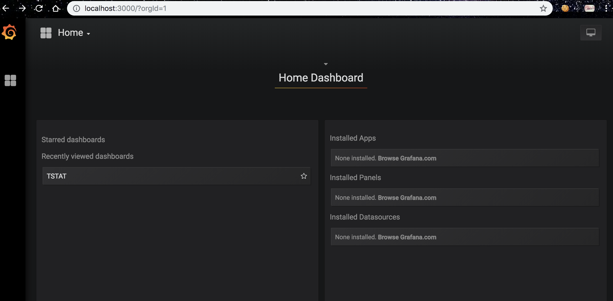

## 2019 JAN WEEK 05

#### Things to do

- [x] View the dashboard without login.

	- Refer the Grafana documentation(http://docs.grafana.org/auth/overview/#anonymous-authentication) to modify Grafana configure file(/etc/grafana/grafana.ini).
	In auth.anonymous section, fill the information like below.
	
	<pre><code>[auth.anonymous]
	enabled = true

	# Organization name that should be used for unauthenticated users
	org_name = Main Org.

	# Role for unauthenticated users, other valid values are `Editor` and `Admin`
	org_role = Viewer</pre></code>
	
	I wandered for about one hour because of the org_name. The organization name can be created in 'grafana page > Configuration > Server Admin > Orgs'. Thus, you can do it with admin authority. 

	

	If you add new organization, you can create dashboards on each organization. And if you set the name of new-organization as the org_name, anonymous will be accessible to the organization's dashboard. The anonymous's role is up to org_role.

	And disable basic auth.

	<pre><code>[auth.basic]
	enabled = false</pre></code>

	But, keep disable_login_from true contrary to documentation. Because if there's need to modify or configure some information in grafana, admin have to login and apply. So, direct access to login page keeps possible.

RESULT: When I access to 'localhost:3000', I can see the Main Org's dashboard. If I click the 'TSTAT' dashboard, I can see the TSTAT's graph.

- [ ] Remove the 'log_tcp_complete.name of data' from graph variable.

- [ ] Modify the process.py to insert data about client to influxDB.

#### Things to do next week

- Divide the graphs by host and port of server and client.
- Make user can view the graph to select a host or port.
